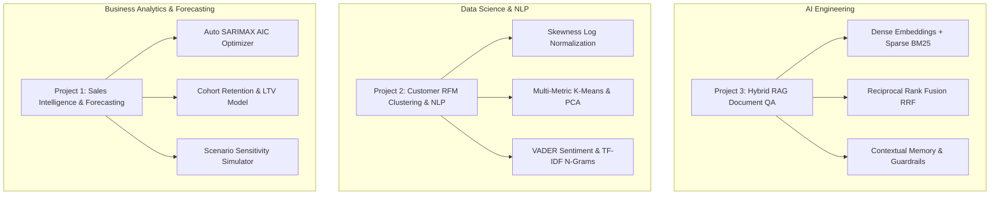

# Enterprise AI, Data Science & Business Intelligence Portfolio

[](https://www.python.org/downloads/release/python-3110/)
[](https://nextjs.org/)
[](https://www.docker.com/)
[](https://opensource.org/licenses/MIT)

A production-grade, hiring-ready portfolio showcasing end-to-end applications across **Artificial Intelligence Engineering**, **Applied Data Science & NLP**, and **Quantitative Business Analytics**.

---

## 🏛️ Portfolio Project Matrix



---

## 📂 Production Project Directory

| Project | Target Role | Key Algorithms & Technologies | Highlights & Artifacts |
| :--- | :--- | :--- | :--- |
| **[Project 1: Sales Analytics & Forecasting](project-1-sales-dashboard/)** | Business Analyst / Analytics Engineer | Python, Streamlit, Plotly, SARIMAX, Statsmodels, Pandas | Automated AIC grid-search, Ljung-Box residual diagnostics, Cohort survival matrices, Customer LTV modeling, Docker container, unit test suite. |
| **[Project 2: Customer Segmentation & NLP](project-2-customer-segmentation/)** | Data Scientist / ML Engineer | Python, Scikit-Learn, NLTK VADER, TF-IDF N-Grams, PCA | Skewness correction, Multi-metric K-Means evaluation (Silhouette, Davies-Bouldin, Calinski-Harabasz), 2D PCA, N-gram topic extraction, CLI runner, unit test suite. |
| **[Project 3: Hybrid RAG QA Engine](project-3-rag-qa-chatbot/)** | AI / LLM Engineer | Python, Google Gemini API, Streamlit, FAISS, PyPDF | Hybrid Dense + Sparse BM25 retrieval, Reciprocal Rank Fusion (RRF), context rewriting, hallucination guardrails, Docker container, unit test suite. |
| **[Portfolio Web App](portfolio-next/)** | Full-Stack AI Interface | Next.js 16 (App Router), React, Space Grotesk, JetBrains Mono | Interactive Neural Canvas, live parametric simulation playground, telemetry HUD diagnostics, responsive dark/light glassmorphism. |

---

## 🚀 Quick Execution Guide

### 1. Launch Next.js Futuristic Portfolio Webpage
```bash
cd portfolio-next
npm run dev
# Access http://localhost:3000 in your browser
```

### 2. Run Project 1 (Sales Forecasting Dashboard)
```bash
cd project-1-sales-dashboard
pip install -r requirements.txt
pytest tests/ -v
streamlit run app.py
```

### 3. Run Project 2 (Customer Clustering & NLP Pipeline)
```bash
cd project-2-customer-segmentation
pip install -r requirements.txt
pytest tests/ -v
python main.py --samples 600 --clusters 3
```

### 4. Run Project 3 (Hybrid RAG QA Engine)
```bash
cd project-3-rag-qa-chatbot
pip install -r requirements.txt
pytest tests/ -v
streamlit run app.py
```

---

## 🧪 Comprehensive Testing & Quality Assurance

All three projects adhere to strict software engineering standards, including isolated virtual environments, comprehensive `pytest` suites, and Docker container definitions:

* **Project 1 Unit Tests**: `project-1-sales-dashboard/tests/test_analysis.py`
* **Project 2 Unit Tests**: `project-2-customer-segmentation/tests/test_clustering.py`, `test_nlp.py`
* **Project 3 Unit Tests**: `project-3-rag-qa-chatbot/tests/test_rag_engine.py`
