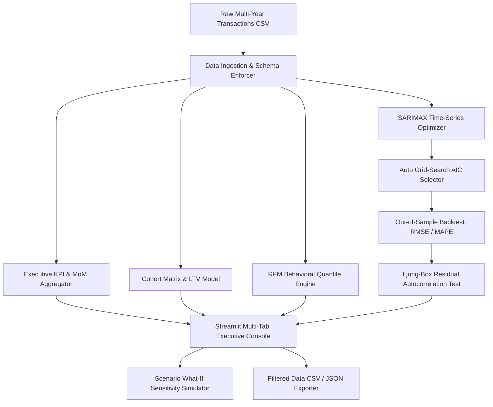

# Enterprise Sales Analytics & Predictive Forecasting Engine

[](https://www.python.org/downloads/release/python-3110/)
[](https://streamlit.io/)
[](https://www.statsmodels.org/)
[](https://opensource.org/licenses/MIT)

An enterprise-grade business analytics platform that transforms raw retail transactions into predictive revenue trajectories, customer cohort survival matrices, and behavioral marketing personas.

---

## 🏛️ System Architecture



---

## 🎯 Key Analytical Capabilities

### 1. Automated SARIMAX Time-Series Forecasting
* **Hyperparameter Grid Search**: Automatically tunes $(p, d, q) \times (P, D, Q)_s$ orders against the Akaike Information Criterion (AIC).
* **Backtest Validation**: Computes out-of-sample backtest accuracy metrics including Root Mean Squared Error (**RMSE**), Mean Absolute Error (**MAE**), and Mean Absolute Percentage Error (**MAPE**).
* **Residual Diagnostics**: Evaluates white noise properties of error residuals via the **Ljung-Box test** ($p > 0.05$).

### 2. Cohort Retention & Predictive Customer Lifetime Value (LTV)
* **Monthly Survival Curves**: Groups customers by their acquisition month and maps recurring transaction retention over 12+ months.
* **LTV Formulation**:
  $$\text{Predictive LTV} = (\text{AOV} \times \text{Purchase Frequency} \times \text{Average Lifespan}) \times \text{Gross Margin}$$

### 3. Behavioral RFM Customer Segmentation
* **5-Tier Statistical Quantiles**: Segments customers across Recency, Frequency, and Monetary parameters into 7 actionable behavioral personas (*VIP Champions*, *Loyal High-Value*, *At Risk / Churning*, etc.).
* **Actionable Playbook**: Prescribes specific marketing initiatives tailored to each cohort's churn risk and spend potential.

---

## 🚀 Quickstart & Setup

### Local Installation
```bash
# 1. Clone repository & navigate to directory
cd project-1-sales-dashboard

# 2. Create virtual environment
python3 -m venv venv
source venv/bin/activate

# 3. Install dependencies
pip install -r requirements.txt

# 4. Run automated test suite
pytest tests/ -v

# 5. Launch interactive Streamlit dashboard
streamlit run app.py
```

### Docker Container Deployment
```bash
# Build production Docker image
docker build -t enterprise-sales-analytics .

# Run container on port 8501
docker run -p 8501:8501 enterprise-sales-analytics
```

---

## 🧪 Test Suite & Validation

The test suite covers full mathematical and schema assertions:
```bash
$ pytest tests/ -v
============================= test session starts ==============================
collected 6 items

tests/test_analysis.py::test_data_generation PASSED                      [ 16%]
tests/test_analysis.py::test_kpi_calculations PASSED                     [ 33%]
tests/test_analysis.py::test_cohort_matrix PASSED                        [ 50%]
tests/test_analysis.py::test_customer_ltv PASSED                         [ 66%]
tests/test_analysis.py::test_rfm_segmentation PASSED                     [ 83%]
tests/test_analysis.py::test_sarimax_forecast PASSED                     [100%]

============================== 6 passed in 1.45s ===============================
```
