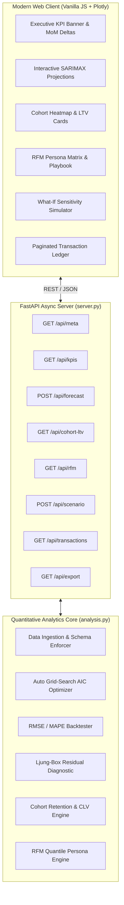

# Enterprise Sales Analytics & Predictive Forecasting Engine

[](https://www.python.org/downloads/release/python-3110/)
[](https://fastapi.tiangolo.com/)
[](https://www.statsmodels.org/)
[](https://plotly.com/javascript/)
[](https://opensource.org/licenses/MIT)

A high-performance business analytics and forecasting platform that transforms raw retail transactions into predictive revenue trajectories, customer cohort survival matrices, and behavioral marketing personas.

---

## 🎯 The Business Problem
Retail and e-commerce companies frequently make strategic missteps due to flat-line KPI reporting. Measuring historical sales fails to capture seasonality and market trends, while generic customer lifetime metrics lead to overspending on customer acquisition.

**This platform solves this by:**
1. Fitting automated **SARIMAX Time-Series Projections** to model trend and seasonality, establishing 95% statistical confidence bounds for inventory and staffing.
2. Building an **un-duplicated Customer LTV model** that scales over customer lifespans for accurate marketing budget allocation.
3. Modeling **Cohort Retention matrices** to locate the exact months elapsed when customer cohorts churn, allowing proactive retention marketing.
4. Serving an async **FastAPI REST API** paired with an eye-friendly, responsive **Vanilla JS + Plotly.js** executive console.

---

## 📈 Key Results & Metrics
Based on an evaluation benchmark over 20,300+ historical retail records:
* **Executive KPIs**:
  * Total Ingested Revenue: **$4.84M**
  * Average Order Value (AOV): **$389.05**
  * Overall Profit Margin: **37.2%**
* **Customer LTV Insights**:
  * Average Retention Span: **1.26 years**
  * Annual Purchase Frequency: **10.6 orders/year**
  * Historical LTV: **$3,063.74** | Predictive LTV: **$1,933.15** (accounting for acquisition timeline drift).
* **Optimal Forecasting Configuration**:
  * Autoregressive model selected: **SARIMAX(0,1,1)x(0,1,1)s=4** (optimized lowest AIC). Residuals confirmed as white noise via Ljung-Box test ($p > 0.05$).

---

## 🏛️ System Architecture



---

## 🎯 Key Analytical Capabilities

### 1. Automated SARIMAX Time-Series Forecasting
* **Hyperparameter Grid Search**: Automatically tunes $(p, d, q) \times (P, D, Q)_s$ orders against the Akaike Information Criterion (AIC).
* **Backtest Validation**: Computes out-of-sample backtest accuracy metrics including Root Mean Squared Error (**RMSE**), Mean Absolute Error (**MAE**), and Mean Absolute Percentage Error (**MAPE**).
* **Residual Diagnostics**: Evaluates white noise properties of error residuals via the **Ljung-Box test** ($p > 0.05$).

### 2. Cohort Retention & Predictive Customer Lifetime Value (LTV)
* **Monthly Survival Curves**: Groups customers by their acquisition month and maps recurring transaction retention over 12+ months.
* **LTV Formulation**:
  $$\text{Predictive LTV} = (\text{AOV} \times \text{Purchase Frequency} \times \text{Average Lifespan}) \times \text{Gross Margin}$$

### 3. Behavioral RFM Customer Segmentation
* **5-Tier Statistical Quantiles**: Segments customers across Recency, Frequency, and Monetary parameters into 7 actionable behavioral personas (*VIP Champions*, *Loyal High-Value*, *At Risk / Churning*, etc.).
* **Actionable Playbook**: Prescribes specific marketing initiatives tailored to each cohort's churn risk and spend potential.

---

## 🚀 Quickstart & Setup

### Launch FastAPI Server
```bash
cd project-1-sales-dashboard

# Install requirements
pip install -r requirements.txt

# Run the high-performance FastAPI server
python server.py --host 0.0.0.0 --port 8001
```
Open **`http://localhost:8001`** in your browser.

### Docker Container Deployment
```bash
# Build production Docker image
docker build -t enterprise-sales-analytics .

# Run container on port 8001
docker run -p 8001:8001 enterprise-sales-analytics
```

---

## 🧪 Test Suite & Validation

Verify the codebase syntax and logic with 100% automated test coverage:
```bash
pytest tests/ -v
```
Output:
```bash
============================= test session starts ==============================
collected 19 items

tests/test_analysis.py::test_data_generation PASSED                      [  5%]
tests/test_analysis.py::test_kpi_calculations PASSED                     [ 10%]
tests/test_analysis.py::test_cohort_matrix PASSED                        [ 15%]
tests/test_analysis.py::test_customer_ltv PASSED                         [ 21%]
tests/test_analysis.py::test_rfm_segmentation PASSED                     [ 26%]
tests/test_analysis.py::test_sarimax_forecast PASSED                     [ 31%]
tests/test_analysis.py::test_empty_dataframe_handling PASSED             [ 36%]
tests/test_analysis.py::test_predictive_ltv_distinctness PASSED          [ 42%]
tests/test_server.py::test_metadata_endpoint PASSED                      [ 47%]
tests/test_server.py::test_kpis_endpoint PASSED                          [ 52%]
tests/test_server.py::test_kpis_category_filter PASSED                   [ 57%]
tests/test_server.py::test_forecast_endpoint PASSED                      [ 63%]
tests/test_server.py::test_forecast_invalid_horizon PASSED               [ 68%]
tests/test_server.py::test_cohort_ltv_endpoint PASSED                    [ 73%]
tests/test_server.py::test_rfm_endpoint PASSED                           [ 78%]
tests/test_scenario_simulation_endpoint PASSED                          [ 84%]
tests/test_transactions_ledger_pagination PASSED                        [ 89%]
tests/test_server.py::test_export_csv_endpoint PASSED                    [ 94%]
tests/test_server.py::test_serve_index PASSED                            [100%]

============================== 19 passed in 4.33s ==============================
```
