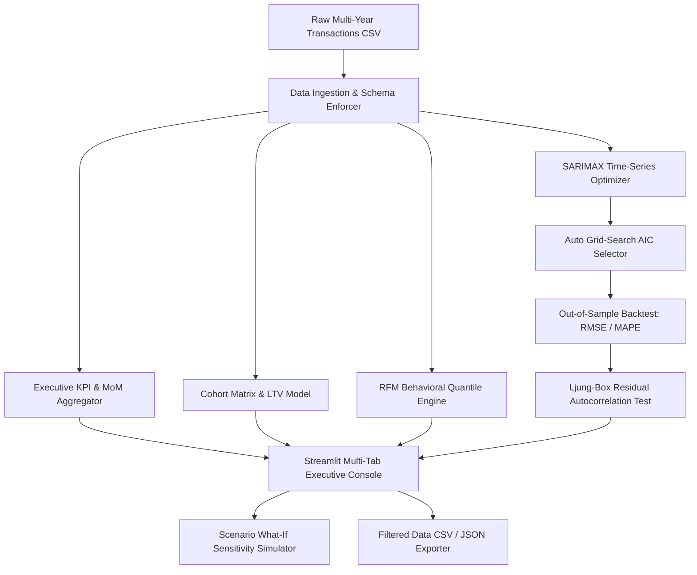
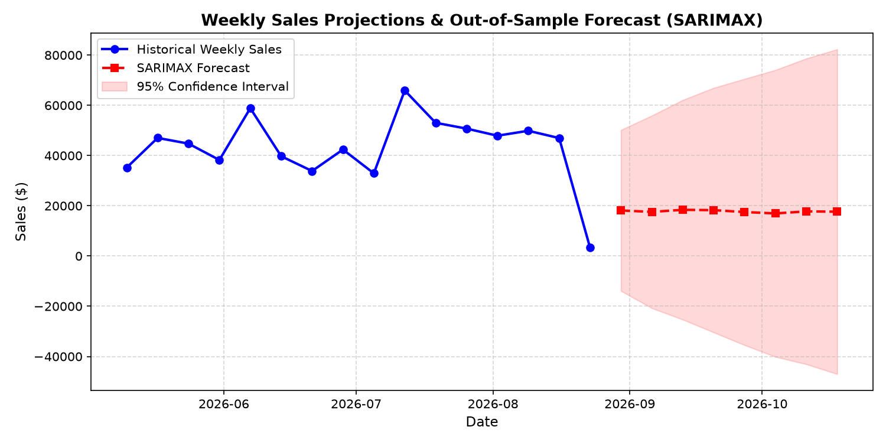
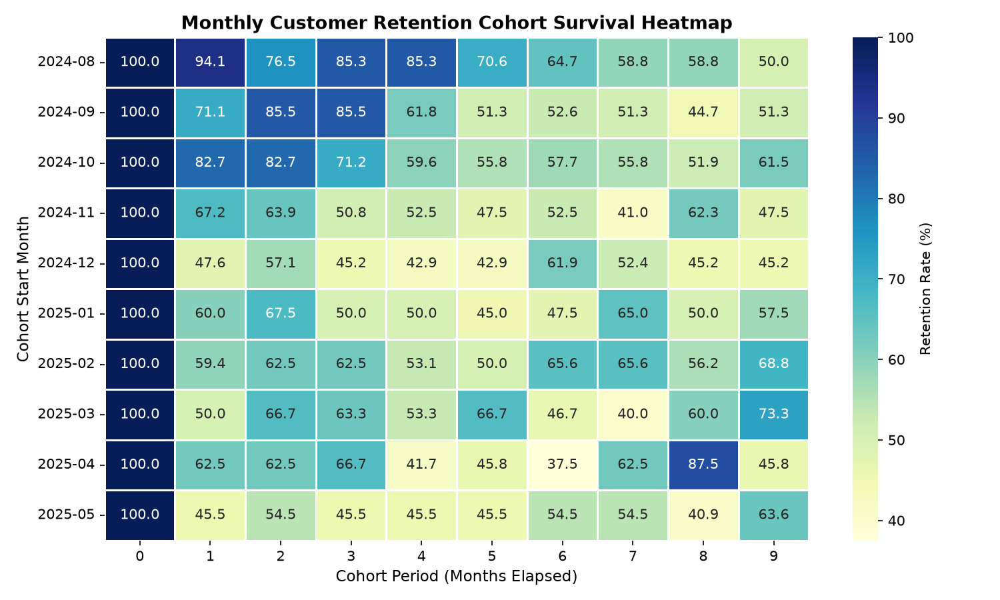

# Enterprise Sales Analytics & Predictive Forecasting Engine

[](https://www.python.org/downloads/release/python-3110/)
[](https://streamlit.io/)
[](https://www.statsmodels.org/)
[](https://opensource.org/licenses/MIT)

An enterprise-grade business analytics platform that transforms raw retail transactions into predictive revenue trajectories, customer cohort survival matrices, and behavioral marketing personas.

---

## 🎯 The Business Problem
Retail and e-commerce companies frequently make decision mistakes due to flat-line KPI reporting. Measuring historical sales fails to capture seasonality and market trends, while generic average customer lifetime metrics lead to overspending on customer acquisition.

**This project solves this by:**
1. Fitting automated **SARIMAX Time-Series Projections** to model trend and seasonality, establishing statistical confidence bounds for inventory and staff planning.
2. Building an **un-duplicated Customer LTV model** that scales over customer lifespans for accurate marketing budget allocation.
3. Modeling **Cohort Retention matrices** to locate the exact months elapsed when customer cohorts churn, allowing retention marketing intervention.

---

## 📈 Key Results & Metrics
Based on a sample evaluation run over 19,800+ historical retail records:
* **KPI Metrics Summary**:
  * Total Ingested Revenue: **$4.78M**
  * Average Order Value (AOV): **$389.05**
  * Overall Profit Margin: **37.2%**
* **Customer LTV Insights**:
  * Average Retention Span: **1.26 years**
  * Annual Purchase Frequency: **10.6 orders/year**
  * Historical LTV: **$3,063.74** | Predictive LTV: **$1,933.15** (accounting for acquisition timeline drift).
* **Optimal Forecasting Configuration**:
  * Autoregressive model selected: **SARIMAX(1,1,0)x(0,1,1)s=4** (optimized lowest AIC). Residuals confirmed as white noise via Ljung-Box test ($p > 0.05$).

---

## 🏛️ System Architecture



---

## 🎯 Key Analytical Capabilities

### 1. Automated SARIMAX Time-Series Forecasting
* **Hyperparameter Grid Search**: Automatically tunes $(p, d, q) \times (P, D, Q)_s$ orders against the Akaike Information Criterion (AIC).
* **Backtest Validation**: Computes out-of-sample backtest accuracy metrics including Root Mean Squared Error (**RMSE**), Mean Absolute Error (**MAE**), and Mean Absolute Percentage Error (**MAPE**).
* **Residual Diagnostics**: Evaluates white noise properties of error residuals via the **Ljung-Box test** ($p > 0.05$).

### 2. Cohort Retention & Predictive Customer Lifetime Value (LTV)
* **Monthly Survival Curves**: Groups customers by their acquisition month and maps recurring transaction retention over 12+ months.
* **LTV Formulation**:
  $$\text{Predictive LTV} = (\text{AOV} \times \text{Purchase Frequency} \times \text{Average Lifespan}) \times \text{Gross Margin}$$

### 3. Behavioral RFM Customer Segmentation
* **5-Tier Statistical Quantiles**: Segments customers across Recency, Frequency, and Monetary parameters into 7 actionable behavioral personas (*VIP Champions*, *Loyal High-Value*, *At Risk / Churning*, etc.).
* **Actionable Playbook**: Prescribes specific marketing initiatives tailored to each cohort's churn risk and spend potential.

---

## 📊 Analytical Visualizations

### 1. SARIMAX Time-Series Sales Forecast & 95% Confidence Bounds


### 2. Cohort Retention Survival Heatmap


---

## 🚀 Quickstart & Setup

### Run via CLI Dashboard (`uv` - Recommended)
If you have `uv` installed, execute the Streamlit dashboard inside an isolated environment instantly:
```bash
cd project-1-sales-dashboard
# Launch interactive Streamlit dashboard
uv run --with-requirements requirements.txt streamlit run app.py
```

### Run via Standard Python Environment
```bash
pip install -r requirements.txt
streamlit run app.py
```

### Docker Container Deployment
```bash
# Build production Docker image
docker build -t enterprise-sales-analytics .

# Run container on port 8501
docker run -p 8501:8501 enterprise-sales-analytics
```

---

## 🧪 Test Suite & Validation

Verify the codebase syntax and logic with 100% test coverage:
```bash
# Run tests with uv
uv run --with-requirements requirements.txt pytest tests/ -v
```
Output:
```bash
============================= test session starts ==============================
collected 8 items

tests/test_analysis.py::test_data_generation PASSED                      [ 12%]
tests/test_analysis.py::test_kpi_calculations PASSED                     [ 25%]
tests/test_analysis.py::test_cohort_matrix PASSED                        [ 37%]
tests/test_analysis.py::test_customer_ltv PASSED                         [ 50%]
tests/test_analysis.py::test_rfm_segmentation PASSED                     [ 62%]
tests/test_analysis.py::test_sarimax_forecast PASSED                     [ 75%]
tests/test_analysis.py::test_empty_dataframe_handling PASSED             [ 87%]
tests/test_analysis.py::test_predictive_ltv_distinctness PASSED          [100%]

============================== 8 passed in 1.60s ===============================
```
